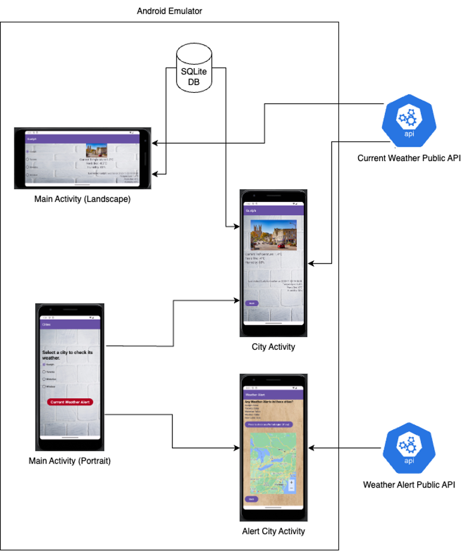

# Weather Alert 

This is an Android app and the goal is to provide updated weather and alert information for updated information. It will fetch the latest weather alert folder published by Canadian weather website and display them as strings and regions on embedded Google Map.


## Screenshots and system diagram


## Run Locally

1. Clone the project

```bash
  git clone https://github.com/yhmyhm0910/WeatherAlert
```

2. Open the project in Android Studio

3. Run the project inside the Android Studio

## Common Contributor

I am the contributor of the frontend and UI development. APIs for fetching Canadian weather website is done by: [taoli1355](https://github.com/taoli1355/weatherAlert)

